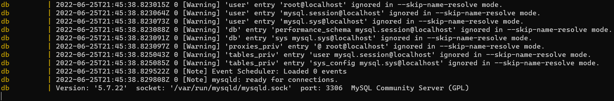
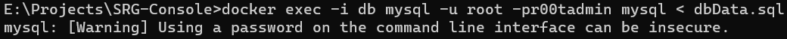
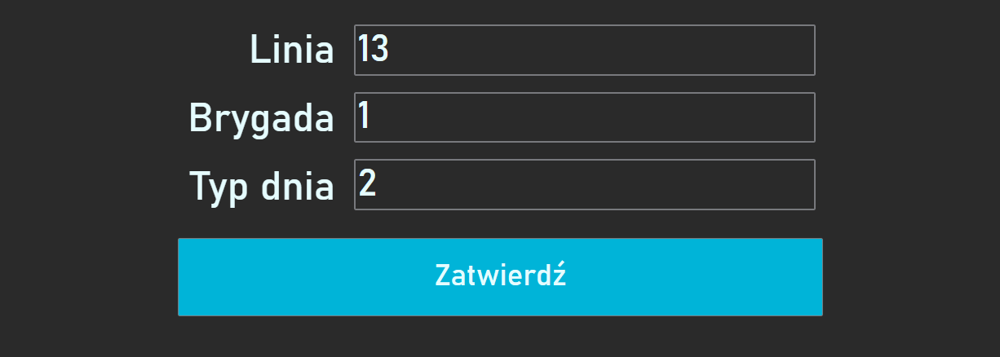
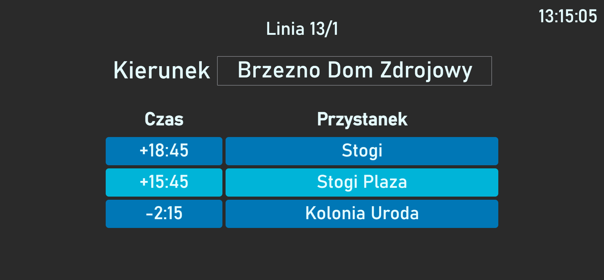

# About
Have you ever heard about the SRG Consoles? These devices are used by modern motormen to check if their course is delayed or is rushed!

What about the retro trams, busses or trolleys? Here's the problem, these transports doesn't have any electronics, therefore this project provide a convenient way of simulating such a console.


> Here's an example of an actual SRG console

## Tech Stack
The project is build on **Docker** which runs 3 microservices:
| **Tech** |                 **It's use**                 |
|:--------:|:--------------------------------------------:|
|   Nginx  |         To host the WWW server Online        |
|   MySQL  | A database for holding the routes timetables |
|    PHP   | Backend of the server that works with the DB |

# Installation
The installation is fairly simple. What You need is a PC or server that has an installed Docker 🐳 and around 1 GB of free space.


1. Open the Command Prompt in the project folder
2. Build the images by typing
   
   ```bash
   docker-compose up --build
   ```

   If you see this message, then everything works properly

   

3. Stop the containers by clicking `CTRL+C`, then launch the Docker Compose in the *detached* mode

   ```bash
   docker-compose up --detach
   ```
4. Create & load the tables to the Database container
   
   *Note: The r00tadmin is the default password*
   ```bash
   docker exec -i db mysql -u root -pr00tadmin mysql < dbData.sql
   ```
5. If you're getting the following output, nothing more then well done - You're all set 🎉!

   

# Screenshots
Panel for choosing the route, brigade & the type of ride.



SRG Console simulation



# Authors
- Hubert Lewandowski (*RooTender*)
- Łukasz Zaleski (*lukasz340*)
- Michał Spychalski (*spychalak*)