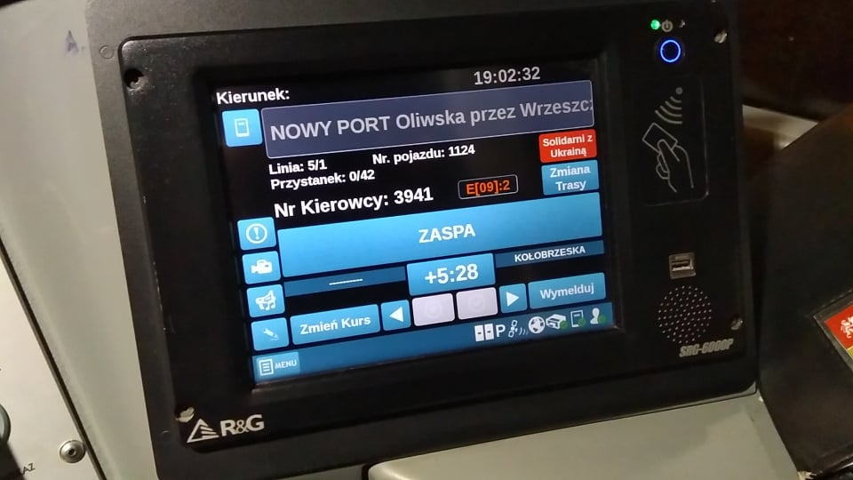

# About
Have you ever heard about the SRG Consoles? These devices are used by modern motormen to check if their course is delayed or is rushed!

What about the retro trams, busses or trolleys? Here's the problem, these transports doesn't have any electronics, therefore this project provide a convenient way of simulating such a console.

> Here's an example of an actual SRG console

## Tech Stack
The project is build on **Docker** which runs 3 microservices:
| **Tech** |                 **It's use**                 |
|:--------:|:--------------------------------------------:|
|   Nginx  |         To host the WWW server Online        |
|   MySQL  | A database for holding the routes timetables |
|    PHP   | Backend of the server that works with the DB |

# Installation
The installation is fairly simple. What You need is a PC or server that has an installed Docker 🐳 and around 1 GB of free space.
